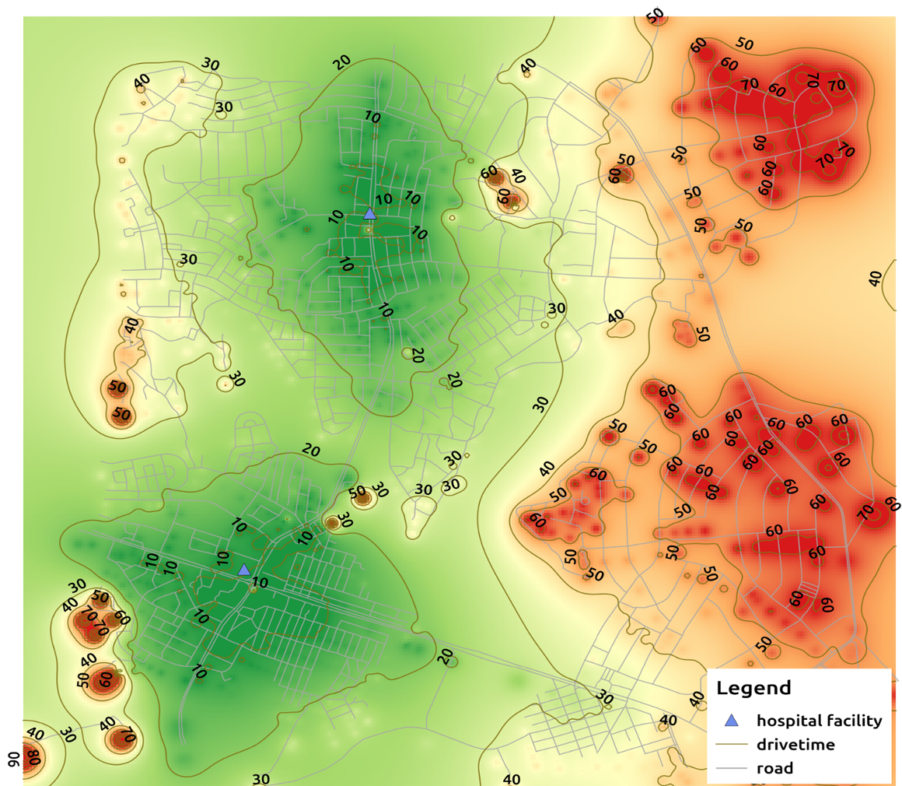

Isochrones Qgis Plugin
=======

QGIS plugin that creates isochrones map from network data.

Site - https://samweli.github.io/isochrones (still on development)

## Installation

Install QGIS. Download it from http://download.qgis.org/. Instructions on installing QGIS for 
different Operating Sytstems is available here 
[https://www.qgis.org/en/site/forusers/download.html#tab1](https://www.qgis.org/en/site/forusers/download.html#tab1)

### Install from QGIS plugin repository

- Launch QGIS application and open plugin manager.
- Search for `Isochrones` in the `All` page of the plugin manager.
- From the found results, click on the `Isochrones` result item and a page with plugin information will show up.
     
- Click the `Install Plugin` button at the bottom of the dialog to install the plugin.

After a successful install the plugin will be added to the QGIS plugins menu and database menu.

### Install from a ZIP file
- Get the plugin ZIP file from [https://github.com/samweli/isochrones/releases](https://github.com/samweli/isochrones/releases), 
  select the required release ZIP file and download it. 
- From the `Install from ZIP` page in the QGIS plugin manager, 
  select the downloaded ZIP file and click the `Install Plugin` button to install it.

    

### Install from a plugin custom repository

The plugin is available on a custom QGIS plugin repository that host the plugin most recent versions. 

The plugin from the custom repository can be used to get the latest features that haven't landed on the official released plugin version that 
are published in the QGIS official plugin repository.

The plugin versions available through the custom repository will be flagged experimental. 
This is because the custom repository might contain plugin versions that have not been approved yet for official use.

When updating the plugin manager users should, in order to make sure the plugin manager fetches the experimental plugins 
from the custom repository.

Following the below steps to add the custom repository and install the plugin from it.

- From the plugin manager enable download of experimental plugins.

  
- Select the `Settings` page from the QGIS plugin manager.
- Click `Add` button on the Plugin Repositories group box and use the plugin custom repository found
  here [https://samweli.github.io/isochrones/repository/plugins.xml](https://samweli.github.io/isochrones/repository/plugins.xml) 
  to create a new plugin repository entry.
  
  
- Disable the QGIS official plugin repository and go back to the `All` page, search for `Isochrones` and install it from there.

### Install from source code

- Download or clone this repository and add the plugin folder into the QGIS plugin directory.
The plugin directory is found on the QGIS profile folder under `profile_name/plugins`,
 eg. `default/plugins`.
 
  QGIS active profile folder can be found by going to **User Profiles > Open Active Profile Folder**
    

- Restart your Qgis, go to **Plugins -> Manage and Install Plugins** search for `Isochrones` 
- Search results will show a result item with `Isochrones` title, toggle the checkbox beside the title to 
  activate the plugin.

### Requirements

Postgres Database with version 9.5 or above, 
with [Postgis](https://postgis.net)(`tested with version 3.1`) and 
[pgRouting](https://pgrouting.org) (`tested with version 3.1.3`)
extensions installed.

### How to

#### Running

##### Step 1
- Setup two postgresql tables one for the network and other for the catchments areas.

- Use test data is found here
  [https://github.com/Samweli/isochrones/tree/master/test/data](https://github.com/Samweli/isochrones/tree/master/test/data)
  these are shapefiles that you will need to import in your postgresql database as tables.

##### Step 2

- Make note of the important columns that will be needed when using the plugin, 
  this includes the unique identifier and geometric column for both tables.
- The network data is required to have a column with a name `cost` and a number type, this will be used 
  for the path calculations during isochrones creation.
- Open the plugin (it will be on the Database Menu and the QGIS toolbar) and fill the connection details followed by tables details. 
- Checking the "Create isochrones map style" will generate tin and contour with a default plugin style.

You can watch the demo video here [https://www.youtube.com/watch?v=thBKETlQbqY](https://www.youtube.com/watch?v=thBKETlQbqY)

#### Data

The network data before imported in the database should be prepared for routing, information on doing this can be found 
here [http://www.bostongis.com/PrinterFriendly.aspx?content_name=pgrouting_osm2po_1](http://www.bostongis.com/PrinterFriendly.aspx?content_name=pgrouting_osm2po_1) 

## Licence

Isochrones is a free software: you can redistribute it and/or modify it under the terms of the GNU General Public License version 2 (GPLv2) as published by the Free Software Foundation.

The full GNU General Public License is available in LICENSE.txt or http://www.gnu.org/licenses/gpl.html

